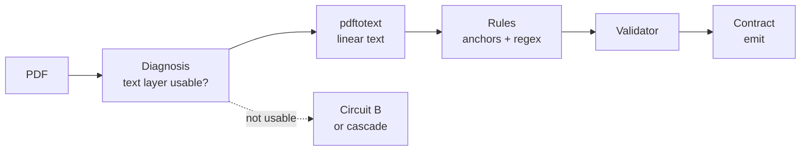
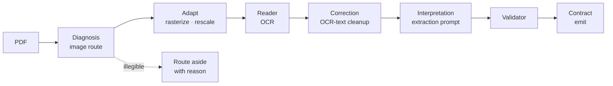
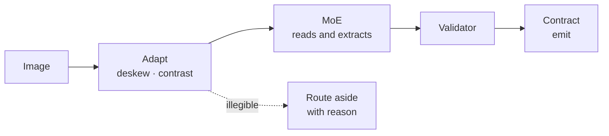
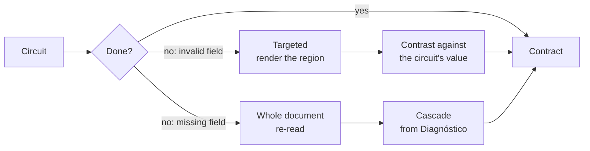

# Workflows

How the direct circuits are built out of the components defined in `README.md`.

`README.md` defines **components** (what they produce) and **three general flows** (Rules, Interpretation, Vision — named by what the extractor receives). This document defines the **direct circuits** (named by what the input is) and maps each one onto those components.

The two decompositions are orthogonal, not competing:

| Decomposition | Named by | Answers |
|---|---|---|
| **General flows** (`README.md`) | Extraction method | *How do we read the values?* |
| **Direct circuits** (this file) | Input type | *How much machinery does this file need?* |

A circuit always resolves to one of the general flows for its extraction step. What changes is how much of the surrounding component set runs.

---

## Why circuits exist

The general cascade runs every component. That is correct for a mixed, unknown corpus and expensive for a homogeneous one.

At 11k files most inputs will fall into three narrow shapes: a PDF that already has clean text, a PDF that is pure image, and a plain image. For those, most components have nothing to do — the Segmenter on a single-invoice image, the Identifier once the type is known, the Reconstructor on one page.

A circuit is the same pipeline with the components whose job is already known to be unnecessary removed.

---

## The selector: Diagnosis

Circuits are not a separate architecture — they are the routes **Diagnosis** already computes.

`README.md` has Diagnosis running before the read, detecting what is there, measuring whether it is processable, and adapting the input. Its own routing table is what separates a text layer from an image. A circuit is Diagnosis's verdict carried to its conclusion instead of merging back into the shared path.

That is also why the circuits keep a piece of Diagnosis even when they skip nearly everything else: without the detection step there is no gate, and the circuit's input assumption is unchecked.

**The gate must be quality, not presence.** `README.md` is explicit that a PDF can carry an old, bad OCR layer, and that routing by presence sends it to conversion and drags its errors along unreviewed. The check is proportion and quality — a layer with 40 characters on an A4 sheet is not a text PDF.

---

## Component usage

Which components each route runs, relative to the general cascade.

| Component | Cascade | A: Text PDF | B: Image-only PDF | C: Image |
|---|:---:|:---:|:---:|:---:|
| **Segmenter** | ✓ | — | — | — |
| **Identifier** | ✓ | — | — | — |
| **Diagnosis** | ✓ | ✓ | ✓ | ◐ |
| **Reader** | ✓ | ◐ | ✓ | — |
| **Reconstructor** | ✓ | — | — | — |
| **Validator** | ✓ | ✓ | ✓ | ✓ |
| **Consistency** | ✓ | — | — | — |
| **Catalog** | ✓ | — | — | — |
| **Contract** | ✓ | ✓ | ✓ | ✓ |
| **Reviewer** | ✓ | ✓ | ✓ | ✓ |

✓ runs in full · ◐ runs partially or in a reduced form · — does not run

**Two components run in every route.**

- **Validator** — it does not care how a value was obtained. Schema, type, content and check-digit checks apply unchanged whatever produced the field. Dropping validation is what would make a circuit a fork of the system rather than a route through it.
- **Contract** — this is what makes circuits substitutable at all. The consuming system must receive the same output shape whether a file went through the cascade or a circuit, so the Contract and its verdict vector are non-negotiable.

---

## Circuit A — Text PDF

**Input:** a PDF with a usable text layer, containing one logical document.

| Step | Component it stands in for | What it does |
|---|---|---|
| Text layer check | Diagnosis | Proportion and quality of the layer |
| `pdftotext` | Reader (conversion) + Reconstructor | Emits a linear text stream |
| Anchors + regex | Rules extraction | Locates the value by anchor and captures it |
| Schema, type, arithmetic | Validator | Unchanged |
| Verdict vector | Contract | Unchanged |

**Where the reduction is honest.** Conversion has no correction step — `README.md` is clear that a converter does not read badly, it transcribes what is there, and that applying a language model "just in case" can only introduce damage. A text PDF genuinely does not need OCR or correction.

**Where the reduction is a trade.** `pdftotext` produces reading order, but it does so heuristically: it does not associate a table header with rows continuing on the next page, and it does not collapse a header repeated across five pages. That is the Reconstructor's job and it is not being done. Linear text with a broken table is still plausible-looking text, so the failure is quiet.

Its trace is the **exact offset** into the text stream, the strongest traceability any circuit offers.

---

## Circuit B — Image-only PDF

**Input:** a PDF with no usable text layer, containing one logical document.

This is the general cascade **minus segmentation, identification, reconstruction and contrast** — the sequence `README.md` already describes for the image path, terminated after extraction.

| Step | Component it stands in for | What it does |
|---|---|---|
| Image route | Diagnosis | Detects no usable layer, measures legibility |
| Rasterize, rescale, compress | Diagnosis (adapt) | Prepares the input for OCR |
| OCR | Reader (OCR path) | Extracts tokens, with estimated confidence |
| OCR correction | Reader (correction) | The only path where correction is legitimate |
| Extraction prompt | Interpretation | An LLM finds the fields in the corrected text |
| Validation | Validator | Unchanged |
| Emit | Contract | Unchanged |

**Legibility is the gate, and it is not resolution.** `README.md` distinguishes the two: an image can have enough DPI and still be out of focus. Passing a blurred page to OCR anyway is the one invalid outcome it names — OCR returns invented text indistinguishable from a real reading. This circuit therefore inherits both valid exits from Diagnosis (preprocess, or route aside with a reason) and must not add a third.

**What the correction step needs.** It is the highest-risk step in the circuit: it is a model editing text, so it can silently change a value. Correction must be scoped to characters and spacing, never to digits, and the raw OCR output has to be retained alongside the corrected text for audit. `d.md`'s rule applies directly — auditing is not normalizing, and the raw value is what diagnostics are built from.

**Where the reduction is a trade.** No Reconstructor means no table reconstruction, so the extraction prompt sees text whose row structure may already be broken. `README.md` warns that structure has to be validated separately, because a shifted column has real amounts and passes every value check.

---

## Circuit C — Image

**Input:** a photo or scan, single page.

| Step | Component it stands in for | What it does |
|---|---|---|
| Image treatment | Diagnosis (adapt only) | Deskew, contrast, rescale |
| MoE | Interpretation + Vision fusion | Reads and extracts in a single pass |
| Validation | Validator | Unchanged |
| Emit | Contract | Unchanged |

**This is the shortest route and the only one with no separate read step.** `README.md` notes that Vision uses neither Diagnosis nor Reader: it hands pixels to the model, which reads and extracts in one step. This circuit is that observation taken literally, with only the treatment half of Diagnosis retained because a photo needs geometric correction before any model sees it.

**Diagnosis is partial here, and that is the risk.** With the detection half gone, nothing measures whether the image is legible before the MoE is asked to read it — so the model is the first thing to see the pixels, and a low-quality input surfaces as low-confidence extraction rather than as a routing decision. The treatment step is the only defense, and it corrects, it does not reject.

**No continuity step.** The general Vision flow still needs cross-page continuity (`README.md` marks it ◐ there for exactly that reason). A single-page image has no page boundary, so the circuit does not drop this step — the step has nothing to do.

---

## What every circuit gives up

Grouped by the component removed, since `README.md` already states each consequence.

| Removed | Consequence | Detectable downstream? |
|---|---|---|
| **Segmenter** | Assumes one file = one document. Fields from a second document overwrite the first's | **No** — `README.md` calls this unrecoverable and silent |
| **Identifier** | No type, so no template routing and no evidence record. A misrouted document is invisible | Only as a badly extracted field, at the end |
| **Reconstructor** | No cross-page table continuity, no header collapsing, no reading order | Partially: as missing or misattributed fields |
| **Cross-flow contrast** | No second read of a critical field. A plausible-but-false value (15400 vs. 1540) passes every internal check | **No** — `README.md` calls contrast the only mechanism that sees this |
| **Catalog** | Identity fields never checked externally. A valid CUIT on the wrong company is undetected | Only by a human eventually noticing |

**The two silent ones are the Segmenter and the contrast.** Every other reduction degrades into something visible — a missing field, a low confidence, an arithmetic failure. Those two produce output that looks correct.

This is the cost of a circuit, stated plainly: it is not merely cheaper, it is cheaper *by removing the checks that catch silent errors*. A circuit is sound exactly as long as its input assumption holds, which is why the gate matters more than the speed.

---

## Escalation

A circuit that cannot finish must **escalate into the general cascade**, not to review.

`README.md` makes the Validator the single place where "could not" is defined, and this is why: a circuit failure is not a new kind of failure, it is the existing escalation with a lower starting point.

**The two escalation kinds cost differently**, and a circuit is more likely to produce the second:

| Kind | What is there | Cost |
|---|---|---|
| **Invalid field** | Value, page, offset | Renders the region. Cheap and precise |
| **Missing field** | Nothing to point at | Whole document re-read — no saving over the cascade |

A circuit routinely has *less* to point at than the cascade, because without the Reconstructor it has no resolved structure to locate a field in. So where the cascade escalates cheaply, a circuit can escalate expensively. This is the number that decides whether a circuit pays: **cost saved on the files it handles, against cost of files it hands on having done partial work.**

**Escalation also recovers the contrast.** A circuit's value exists, so when the cascade re-reads the field, the two values can be compared exactly as two flows are — the circuit is a cheap second opinion that was already paid for.

---

## Output equivalence

Every route emits through the **Contract**, so outputs are shape-identical and the consumer needs no per-circuit logic.

The verdict vector is what makes this honest rather than merely convenient. A field from a circuit will typically carry *weaker* verdicts than one from the cascade — no `consistency` reinforcement, `catalogo: sin_verificar` — and the Contract reports that instead of hiding it. The consumer threshold does the rest.

| Verdict | Cascade | Circuit A | Circuit B | Circuit C |
|---|---|---|---|---|
| `forma` / `tipo` / `contenido` / `digito` | From Validator | Same | Same | Same |
| `consistencia` | Reinforcement or disagreement | `null` | `null` | `null` |
| `catalogo` | Verified / unverified | `sin_verificar` | `sin_verificar` | `sin_verificar` |

**This is the argument for the verdict vector over a score.** With a single confidence number, a circuit's output and the cascade's would have to be collapsed to the same scale and the difference would vanish — a field nobody cross-checked would look the same as one that survived contrast. Kept separate, the consumer can require `consistencia` for critical fields and accept `null` for the rest.

---

## Open questions

- **Declared or inferred.** Whether the caller names the circuit (`--circuit text-pdf`) or the system selects it from Diagnosis. Declared is cheaper and puts the error on the caller; inferred means paying for the detection step before the saving starts.
- **Whether the circuits need the Segmenter after all.** It is the one component whose absence is silent. A cheap continuity check — page numbering, header recurrence — may be enough to keep it, and would close the only silent gap without restoring the full component.
- **Where the fast-path/general-flow boundary is.** This document maps circuits to components but does not fix a selection policy, so nothing yet decides which files take the cheap route.
- **Whether the MoE in circuit C is the general cascade's Vision model** or a cheaper specialist. It decides whether tuning and the golden set carry over between them.
- **Whether the OCR correction step is validated against this circuit's own output.** Since it edits text, it should be measured on the golden set like any other extraction step.
- **`pdftotext` is a poppler dependency** (external binary). It needs a stated version and a fallback, or circuit A silently depends on whatever the host has.
