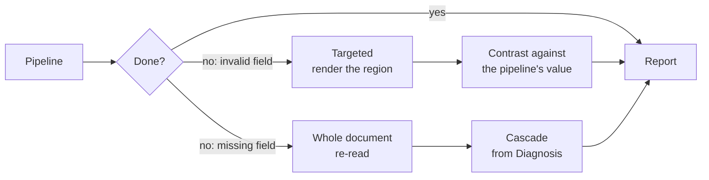

# Workflows

The ten input pipelines, built out of the components defined in `components.md`.

`components.md` defines the **components** (named by what they produce). `README.md` defines the **three method flows** (Rules, Interpretation, Vision — named by what the extractor receives). This document defines the **ten input pipelines** and maps each one onto those components.

**Terminology note.** The source notes in `my_prompt.md` call these "flujos"; `README.md` uses that word for the method flows. To keep the two apart, this document calls the input-routed ones **pipelines**, and codes them `M<material>.<extractor>`.

---

## Ten pipelines are a matrix, not ten designs

The ten come from two independent choices multiplied out, plus the one material where only one choice is possible:

| Axis | Question | Values |
|---|---|---|
| **Material** | How do we obtain something readable? | **M1** text · **M2** image PDF → OCR · **M3** image → OCR · **M4** image, no text step |
| **Extractor** | How do we read values from it? | **.R** rules · **.P** prompts · **.B** both |

$$3 \text{ text-producing materials} \times 3 \text{ extractor modes} + 1 \text{ pixels-only material} \times 1 = 10$$

| | Material path | `.R` rules | `.P` prompts | `.B` both |
|---|---|:---:|:---:|:---:|
| **M1** | text PDF → extract text | 1 | 2 | 3 |
| **M2** | image PDF → convert → OCR | 4 | 5 | 6 |
| **M3** | image → OCR | 7 | 8 | 9 |
| **M4** | image → (no text) | — | 10 | — |

**M4 has one variant only.** Regex needs a string to run on, and M4 never produces one — pixels go to the model and fields come back. So the matrix is 3×3+1, and every other material supports all three extractor modes.

**The material path and the extractor are independent.** M1 and M3 differ only in how text is obtained; `.R` and `.P` differ only in how that text is read. Neither choice constrains the other, which is why the count multiplies rather than adds.

---

## The ten pipelines

Stated in the source notation, with an ID for reference.

| # | Code | Pipeline |
|---|---|---|
| 1 | `M1.R` | text PDF → extract text → rules → report |
| 2 | `M1.P` | text PDF → extract text → prompts → validate → report |
| 3 | `M1.B` | text PDF → extract text → rules / prompts → validate → report |
| 4 | `M2.R` | image PDF → convert img → OCR → rules → validate → report |
| 5 | `M2.P` | image PDF → convert img → OCR → prompts → validate → report |
| 6 | `M2.B` | image PDF → convert img → OCR → rules / prompts → validate → report |
| 7 | `M3.R` | image → OCR → rules → validate → report |
| 8 | `M3.P` | image → OCR → prompts → validate → report |
| 9 | `M3.B` | image → OCR → rules / prompts → validate → report |
| 10 | `M4.P` | image → prompts → validate → report |

### Discrepancy to resolve

Pipeline 1 (`M1.R`) is written **without** a `validar` step, while every other pipeline has one — including `M1.P` and `M1.B` on the same material.

Two readings, and they are not equivalent:

- **An omission.** Then `M1.R` validates like everything else, and the ten are uniform in their tail.
- **Intentional.** Then a rules-only read on a text PDF is treated as self-verifying. That contradicts `components.md`, which has the Validator run four checks including arithmetic and check digit — a regex match proves a value was *captured*, not that it is *correct*. The `README.md` invariant "the model never replaces the Validator" points the same way.

This document assumes the first reading and lists pipeline 1 with validation. If the second was intended, the reason should be recorded, because it would make `M1.R` the only unvalidated path in the system.

---

## Material paths

Each defined once; the extractor is layered on top.

### M1 — text PDF

**Honest reduction.** Conversion needs no correction — `components.md` is clear that a converter does not read badly, it transcribes what is there, and that applying a language model "just in case" can only introduce damage.

**The trade.** `pdftotext` produces reading order heuristically: it does not associate a table header with rows continuing on the next page, and does not collapse a header repeated across five pages. That is the Reconstructor's job and it is not being done. Broken linear text still looks plausible, so the failure is quiet.

**Trace.** Exact offset for a regex match, quote + offset for a prompt — both offsets into a text stream.

### M2 — image PDF

**M2 is M3 with a conversion prefix.** Once rasterized, the steps are identical, so `M2.*` and `M3.*` should share one implementation with a switch at the front. Six of the ten pipelines are really three designs with a prefix; divergence between them would be an accident rather than a decision.

### M3 — image via OCR

**What it loses:** everything visual. Layout, signatures, seals, checkboxes, logos — `components.md` notes the Vision flow is the one that sees signatures and seals, and M3 by construction does not.

**What it inherits:** OCR error is in the text. A pattern has to tolerate the misreads OCR actually produces; a prompt may quietly "repair" a digit it should have flagged. Validation is what catches either, which is why it is not optional here.

### M4 — image, direct prompt

**The shortest pipeline and the only one with a single read.** No text intermediate, so no OCR, no regex, and nothing to contrast against.

**What it uniquely sees:** the model gets pixels, so it is the only pipeline that can use visual evidence — a signature, a seal, a checkbox, a logo — as part of extraction rather than as something lost in conversion.

**What it uniquely risks:** with one fused read there is no second opinion, and with no text intermediate there is no offset to trace — the trace is a bounding region, inherently less precise than a character offset.

**Diagnosis is absent by design**, matching `README.md`'s note that Vision uses neither Diagnosis nor Reader. The consequence: nothing measures legibility before the model reads, so a bad input surfaces as low-confidence extraction rather than as a routing decision.

---

## Extractor modes

Each defined once; the material path is beneath it.

### `.R` — rules only

Regex over the text. **Invents nothing** and is deterministic; it either captures a value that is there or fails.

**Two limits, and the second is the serious one:**

- Needs one pattern per wording variant, and at 11k files the variants are unknown.
- **An anchor error is invisible.** `README.md` is explicit that a bad anchor in Rules is detected *only* by cross-flow contrast, because the value is real and has the correct shape and type. With no second read, `.R` has no way to notice it took the value from the neighboring block.

So `.R` is the cheapest mode and, on its own, the one with the least ability to catch its own characteristic error.

### `.P` — prompts only

A prompt over the text (or over pixels, in M4). **Tolerates wording variation**, which is what makes it viable when the corpus is unknown.

**Two limits:**

- **Can invent values.** Arithmetic and check digit in the Validator are what catch this — which is why validation is not optional.
- **Can misattribute.** A real value assigned to the wrong field, which is `README.md`'s semantic-confusion failure mode.

**Trace** is a quote + offset for text materials, a bounding region for M4.

### `.B` — both

Runs `.R` and `.P` over the **same text** and lets Consistency compare them.

**This is the only mode that produces contrast**, and contrast is the one mechanism that catches a plausible-but-false value: a total of 15400 that was 1540 passes shape, type and content, and has no check digit. Nothing internal sees it. A disagreement between two reads does.

**Why it is cheap here.** `components.md` reserves cross-flow contrast because each method flow re-acquires the document. In a text pipeline **the acquisition is already paid for** — the text is in hand, so a second read costs one extra call on critical fields, not a second pass over the document. Contrast has never been cheaper than in `M1.B`, `M2.B` and `M3.B`.

**`.B` is not available in M4**, because there is no text for a regex to run on.

---

## What each of the ten buys

| # | Code | Deterministic | Invents values | Contrast | Sees visuals | Trace |
|---|---|:---:|:---:|:---:|:---:|---|
| 1 | `M1.R` | Yes | No | — | No | exact offset |
| 2 | `M1.P` | No | Yes | — | No | quote + offset |
| 3 | `M1.B` | — | — | **✓** | No | exact + quote |
| 4 | `M2.R` | Yes | No | — | No | exact offset |
| 5 | `M2.P` | No | Yes | — | No | quote + offset |
| 6 | `M2.B` | — | — | **✓** | No | exact + quote |
| 7 | `M3.R` | Yes | No | — | No | exact offset |
| 8 | `M3.P` | No | Yes | — | No | quote + offset |
| 9 | `M3.B` | — | — | **✓** | No | exact + quote |
| 10 | `M4.P` | No | Yes | — | **✓** | bounding region |

**Only 3 of the 10 have contrast**, and they are exactly the `.B` ones. The other seven produce a single read, so each carries one of the two blind spots:

| Blind spot | Pipelines | What goes undetected |
|---|---|---|
| **Single read, no contrast** | 1, 4, 7 (`.R`) | A bad anchor — a real value taken from the wrong place |
| **Single read, no contrast** | 2, 5, 8, 10 (`.P`) | A plausible-but-false value, and a bad anchor |
| **None of the above** | 3, 6, 9 (`.B`) | — contrast is present |
| **No visual evidence** | 1–9 | Signatures, seals, checkboxes, logos |
| **No text, no offset** | 10 | Precise traceability |

**This table is the whole decision surface.** Choosing a pipeline is choosing which blind spot to accept, which is why the extractor choice is not a detail — it decides whether the pipeline can catch its own characteristic error.

---

## Contrast is cheaper here than in the cascade

`components.md` reserves cross-flow contrast because running two method flows is expensive — each re-acquires the document. In a text pipeline the acquisition is already paid for:

| Pipelines | Contrast available |
|---|---|
| 3, 6, 9 (`.B`) | **Yes** — rules and prompts over the same text, on critical fields |
| 1, 2, 4, 5, 7, 8 (`.R`, `.P`) | No — a single read |
| 10 (`M4.P`) | No — a single fused read, nothing to compare against |

Running both costs one extra call on critical fields, not a second pass over the document. **This is the strongest argument for `.B` over `.R` or `.P` when the material is text**: it is the only mode whose characteristic failure is detectable.

---

## Component usage

| Component | M1 | M2 | M3 | M4 |
|---|:---:|:---:|:---:|:---:|
| **Segmenter** | — | — | — | — |
| **Identifier** | — | — | — | — |
| **Diagnosis** | *selector* | *selector* | *selector* | *selector* |
| **Reader** | ✓ conversion | ✓ OCR | ✓ OCR | — |
| **Reconstructor** | — | — | — | — |
| **Validator** | ✓ | ✓ | ✓ | ✓ |
| **Consistency** | ◐ `.B` only | ◐ `.B` only | ◐ `.B` only | — |
| **Catalog** | — | — | — | — |
| **Contract** | ✓ | ✓ | ✓ | ✓ |
| **Reviewer** | ✓ | ✓ | ✓ | ✓ |

✓ runs in full · ◐ only in the `.B` variants · — does not run · *selector* gates the pipeline, does not run inside it

**Diagnosis selects; it does not appear inside a pipeline.** Choosing M1 over M2 asks whether the PDF has a usable text layer — exactly Diagnosis's question in `components.md`, including its warning that the check must be **quality, not presence**, because an old bad OCR layer is not a text layer. Once that answer is known the pipeline starts after the gate, which is why the ten begin at "extract text" or "OCR".

**Validate and Report run in all ten.** The Validator does not care how a value was obtained, so schema, type, content and check-digit checks apply unchanged. The Contract is what makes the ten substitutable: the consumer receives the same output shape whichever route a file took.

---

## What the pipelines give up

| Removed | Consequence | Detectable downstream? |
|---|---|---|
| **Segmenter** | Assumes one file = one document. Fields from a second document overwrite the first's | **No** — `components.md` calls this unrecoverable and silent |
| **Identifier** | No type, so no template routing and no evidence record | Only as a badly extracted field, at the end |
| **Reconstructor** | No cross-page table continuity, no header collapsing, no reading order | Partially: as missing or misattributed fields |
| **Catalog** | Identity fields never checked against an external source | Only by a human eventually noticing |

**Silent losses per pipeline:**

| Pipelines | Silent losses |
|---|---|
| 3, 6, 9 (`.B`) | The **Segmenter** |
| 1, 2, 4, 5, 7, 8 | The **Segmenter**, and the blind spot of a single read |
| 10 | The **Segmenter**, a second read, and precise traceability |

**The Segmenter is the one gap no pipeline closes.** Every other reduction degrades into something visible — a missing field, a low confidence, an arithmetic failure. A merge error produces output that looks correct, which is why the gate that picks the material path matters more than the speed it buys.

---

## Escalation

A pipeline that cannot finish must escalate, not send the case straight to review.

`components.md` makes the Validator the single place where "could not" is defined: a pipeline failure is not a new kind of failure, it is the existing escalation with a lower starting point.

| Kind | What is there | Cost |
|---|---|---|
| **Invalid field** | Value, page, offset | Renders the region. Cheap and precise |
| **Missing field** | Nothing to point at | Whole document re-read — no saving over the cascade |

A pipeline has *less* to point at than the cascade, because without the Reconstructor it has no resolved structure to locate a field in. So where the cascade escalates cheaply, a pipeline can escalate expensively. The number that decides whether a pipeline pays: **cost saved on the files it handles, against cost of files it hands on having done partial work.**

**Escalation also recovers contrast.** A pipeline's value exists, so when the cascade re-reads the field the two values can be compared exactly as two flows are — a second opinion already paid for.

---

## Report is shape-identical across pipelines

Every pipeline reports through the **Contract**, so outputs have the same shape and the consumer needs no per-pipeline logic.

| Verdict | Cascade | `.R` variants | `.P` variants | `.B` variants |
|---|---|---|---|---|
| `shape` / `type` / `content` / `digit` | From Validator | Same | Same | Same |
| `consistency` | Reinforcement or disagreement | `null` | `null` | set — both reads compared |
| `catalog` | Verified / unverified | `unverified` | `unverified` | `unverified` |

**This is the argument for the verdict vector over a score.** With a single confidence number, a pipeline's output and the cascade's would collapse to the same scale and the difference would vanish — a field nobody cross-checked would look identical to one that survived contrast. Kept separate, the consumer can require `consistency` on critical fields and accept `null` elsewhere, which is precisely the information needed to choose a pipeline per document type.

---

## Open questions

- **The `M1.R` validation gap.** Whether pipeline 1's missing `validar` was an omission or a decision (see above). If intentional, the justification belongs in the record.
- **Which pipeline, and who decides.** The ten are keyed by material and extractor, but nothing says whether the caller declares the pipeline or the system infers it. For an image, M3 and M4 are both valid and the choice is a real cost/verification trade rather than a technical detail.
- **Whether `.B` is the default for text materials.** It is the only mode that catches its own characteristic failure, and the extra cost is one call on critical fields rather than a re-read. The argument for ever choosing `.R` or `.P` alone needs stating.
- **What decides `.R` vs `.P` inside `.B` when they disagree.** Consistency can break a tie by arithmetic, but only for fields with an arithmetic relation. For an identifier, disagreement has no tie-breaker.
- **What defines a "critical field".** Both the contrast policy and the target of escalation depend on it, and today it exists only as an expression in `components.md`.
- **Whether OCR correction is part of the OCR step.** `components.md` has the Reader correcting OCR output (scoped to characters and spacing, never digits, raw text retained for audit). The ten pipelines do not list it, so it is either inside "OCR" or absent.
- **What happens before OCR in M2 and M3.** Neither lists preprocessing, yet `components.md` has input adaptation (rescale, compress) and treats legibility as distinct from resolution. A blurred photo passed straight to OCR is the one outcome it calls invalid.
- **Whether the Segmenter is needed after all.** It is the only silent gap. A cheap continuity check — page numbering, header recurrence — may be enough to keep it.
- **Whether M4's model is the same one the cascade's Vision flow uses**, or a cheaper specialist. It decides whether tuning and the golden set carry over.
- **What the extraction prompt is built from.** Per document type, derived from the schema, or shared with the general Interpretation flow. If shared, tuning carries over; if not, there are two prompt sets to maintain.
- **`pdftotext` is a poppler dependency** (external binary). It needs a stated version and a fallback, or M1 silently depends on whatever the host has.
- **Whether M2 and M3 should share one implementation.** They are the same pipeline with a conversion prefix, so six of the ten are three designs with a prefix.
