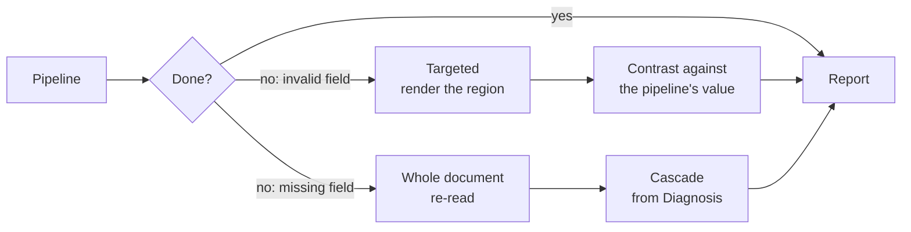

# Workflows

The four input pipelines, built out of the components defined in `components.md`.

`components.md` defines the **components** (named by what they produce). `README.md` defines the **three method flows** (Rules, Interpretation, Vision — named by what the extractor receives). This document defines the **four input pipelines** (named by what the input is) and maps each one onto those components.

**Terminology note.** The source notes in `my_prompt.md` call these "flujos"; `README.md` uses that word for the method flows. To keep the two apart, this document calls the input-routed ones **pipelines (P1–P4)**.

---

## The four pipelines

| | Input | How text is obtained | Extractor | Pipeline |
|---|---|---|---|---|
| **P1** | Text PDF | extract text | rules **or** prompts | `extract text → regex/prompt → validate → report` |
| **P2** | Image PDF | convert to image, then OCR | rules **or** prompts | `convert img → OCR → regex/prompt → validate → report` |
| **P3** | Image | OCR | rules **or** prompts | `OCR → regex/prompt → validate → report` |
| **P4** | Image | — (no text step) | prompts directly on pixels | `prompt → validate → report` |

Every pipeline ends the same way: **validate → report**. That tail is not negotiable, and it is what makes the four substitutable from the consumer's side.

---

## The two axes

Conflating these is the main source of confusion in this document's earlier drafts.

| Axis | Question | Values |
|---|---|---|
| **Material** | How do we obtain something readable? | text (P1), OCR text (P2, P3), pixels (P4) |
| **Extractor** | How do we read values from it? | regex (Rules), prompt (Interpretation), direct vision prompt (Vision) |

**Whenever a pipeline produces text, both extractors are available.** P1, P2 and P3 all end up with a text string, so `rules / prompts` is a genuine choice in each — not a property of the pipeline. Which one runs is a routing decision inside the pipeline.

| Pipeline | Material | regex | prompt | vision prompt |
|---|---|:---:|:---:|:---:|
| **P1** | text | ✓ | ✓ | — |
| **P2** | OCR text | ✓ | ✓ | — |
| **P3** | OCR text | ✓ | ✓ | — |
| **P4** | pixels | — | — | ✓ |

**P4 is the only one without the choice.** With no text intermediate, there is no string for a regex to run on, so the model reads the image and emits fields in one pass. This is `README.md`'s **Vision** flow: it uses neither Diagnosis nor Reader, because reading and extraction collapse into a single step.

---

## P1 — Text PDF

**Input:** a PDF with a usable text layer.

| Step | Component | What it does |
|---|---|---|
| Extract text | Reader (conversion) | Emits a linear text stream |
| Extractor | Rules **or** Interpretation | Regex or a prompt over the text |
| Validate | Validator | Schema, type, content, check digit |
| Report | Contract | Verdict vector per field |

**Where the reduction is honest.** Conversion has no correction step — `components.md` is clear that a converter does not read badly, it transcribes what is there, and that applying a language model "just in case" can only introduce damage. A text PDF genuinely needs neither OCR nor correction.

**Where the reduction is a trade.** `pdftotext` produces reading order, but heuristically: it does not associate a table header with rows continuing on the next page, and does not collapse a header repeated across five pages. That is the Reconstructor's job and it is not being done. Linear text with a broken table still looks plausible, so the failure is quiet.

**Trace:** exact offset for a regex match, quote + offset for a prompt. Both are offsets into a text stream, which keeps traceability here stronger than in P4.

---

## P2 — Image PDF

**Input:** a PDF with no usable text layer.

| Step | Component | What it does |
|---|---|---|
| Convert to image | — (rasterization step) | Rasterizes the PDF into page images |
| OCR | Reader (OCR path) | Extracts tokens, with estimated confidence |
| Extractor | Rules **or** Interpretation | Regex or a prompt over the corrected text |
| Validate | Validator | Unchanged |
| Report | Contract | Unchanged |

**P2 is P3 with a conversion prefix.** Once the PDF is rasterized, the remaining steps are identical to P3. That means the two share one implementation with a switch at the front — worth keeping in mind so they do not drift apart.

---

## P3 — Image, via OCR

**Input:** an image (photo or scan), read by OCR first.

| Step | Component | What it does |
|---|---|---|
| OCR | Reader (OCR path) | Extracts tokens, with estimated confidence |
| Extractor | Rules **or** Interpretation | Regex or a prompt over the corrected text |
| Validate | Validator | Unchanged |
| Report | Contract | Unchanged |

**This is the cheap image path.** OCR reduces the image to text, so the downstream extraction is the same as P1's — regex is available, and a prompt reads a string rather than pixels. What it loses is everything visual: layout, signatures, seals, checkboxes, logos. `components.md` notes that the Vision flow is the one that sees signatures and seals; P3 by construction does not.

**OCR error is present in the text.** A pattern has to tolerate the misreads OCR actually produces, and a prompt may quietly "repair" a digit it should have flagged. The Validate step is what catches the result, which is why it is not optional here.

---

## P4 — Image, direct prompt

**Input:** an image, sent to the model with no OCR step.

| Step | Component | What it does |
|---|---|---|
| Prompt | Vision | Reads and extracts in a single pass |
| Validate | Validator | Unchanged |
| Report | Contract | Unchanged |

**The shortest pipeline and the only one with one read.** No text intermediate exists, so there is no OCR, no regex, and no second read to compare against.

**What it uniquely sees.** Because the model gets pixels, this is the only pipeline that can use visual evidence — a signature, a seal, a checkbox, a logo — as part of the extraction rather than as something lost in conversion.

**What it uniquely risks.** With a single fused read there is nothing to contrast against, so a plausible-but-false value has no detector. And with no text intermediate, there is no offset to trace — the trace is a bounding region, which is inherently less precise than the text pipelines' character offsets.

**Diagnosis is absent here by design**, matching `README.md`'s note that the Vision flow uses neither Diagnosis nor Reader. The consequence: nothing measures legibility before the model is asked to read, so a bad input surfaces as low-confidence extraction rather than as a routing decision.

---

## Component usage

| Component | P1 Text PDF | P2 Image PDF | P3 Image→OCR | P4 Image→prompt |
|---|:---:|:---:|:---:|:---:|
| **Segmenter** | — | — | — | — |
| **Identifier** | — | — | — | — |
| **Diagnosis** | *selector* | *selector* | *selector* | *selector* |
| **Reader** | ✓ conversion | ✓ OCR | ✓ OCR | — |
| **Reconstructor** | — | — | — | — |
| **Validator** | ✓ | ✓ | ✓ | ✓ |
| **Consistency** | ◐ | ◐ | ◐ | — |
| **Catalog** | — | — | — | — |
| **Contract** | ✓ | ✓ | ✓ | ✓ |
| **Reviewer** | ✓ | ✓ | ✓ | ✓ |

✓ runs in full · ◐ available only when both extractors run · — does not run · *selector* gates the pipeline, does not run inside it

**Diagnosis selects; it does not appear inside the pipelines.** Deciding P1 from P2 means asking whether the PDF has a usable text layer — which is exactly Diagnosis's question in `components.md`, including its warning that the check must be *quality*, not presence, because an old bad OCR layer is not a text layer. Once the answer is known the pipeline starts after that gate, which is why the four flows above begin at "extract text" or "OCR" rather than at a diagnosis step.

**This is also the P3/P4 fork for images.** Diagnosis is where the question "can this be read as text?" would be answered; the four pipelines assume it already was, and that a caller or selector chose OCR-then-text extraction or a direct vision prompt.

**The tail is identical in all four.** Validate and Report run everywhere. The Validator does not care how a value was obtained, so schema, type, content and check-digit checks apply unchanged whatever produced the field. Dropping validation is what would turn a pipeline into a fork of the system rather than a route through it.

**The Contract is what makes them substitutable.** The consuming system must receive the same output shape whether a file went through P1 or P4, so the Report step and its verdict vector are non-negotiable.

---

## Contrast is cheaper here than in the cascade

`components.md` reserves cross-flow contrast because running two method flows is expensive — each re-acquires the document. In a **text** pipeline the acquisition is already paid for:

| Pipeline | Contrast available |
|---|---|
| **P1, P2, P3** | **Yes** — regex and prompt over the same text, on critical fields |
| **P4** | No — a single fused read, nothing to compare against |

Running both extractors costs one extra call on critical fields, not a second pass over the document. This is the strongest argument for keeping a regex path even when a prompt is the primary extractor: it is not a fallback, it is the second opinion that catches a plausible-but-false value.

P4 cannot do this. If contrast on critical fields is required, that requirement is what pushes an image toward P3 despite P4's other advantages — a real trade between what P4 sees and what P3 can verify.

---

## Choosing regex or prompt

Both run over the same text, so the choice is open and cheap to revisit.

| | Regex (Rules) | Prompt (Interpretation) |
|---|---|---|
| Invented values | **No** — captures what is there or fails | **Yes** — can produce a value nobody wrote |
| Bad anchor | Textual proximity: a real value from the neighboring block | Semantic confusion: a real value attributed to the wrong field |
| Deterministic | Yes | No |
| Handles wording variation | Needs a pattern per variant | Tolerates it |
| Cost | Negligible | One model call |
| Trace | Exact offset | Quote + offset |

Neither dominates, and the sensible use is **both**:

- **Regex where the field is stable** — identifiers, dates, amounts with a known format. Deterministic, free, invents nothing.
- **Prompt where the wording varies** — supplier names, descriptions, fields whose anchor differs per issuer. At 11k files the variants are unknown, and one pattern per variant is what makes pure regex brittle.
- **Both on critical fields** — the contrast above, at the cost of one extra call.

---

## What the pipelines give up

Grouped by the component removed, since `components.md` already states each consequence.

| Removed | Consequence | Detectable downstream? |
|---|---|---|
| **Segmenter** | Assumes one file = one document. Fields from a second document overwrite the first's | **No** — `components.md` calls this unrecoverable and silent |
| **Identifier** | No type, so no template routing and no evidence record | Only as a badly extracted field, at the end |
| **Reconstructor** | No cross-page table continuity, no header collapsing, no reading order | Partially: as missing or misattributed fields |
| **Catalog** | Identity fields never checked against an external source | Only by a human eventually noticing |

**Silent losses per pipeline:**

| Pipeline | Silent losses |
|---|---|
| **P1, P2, P3** | The **Segmenter** |
| **P4** | The **Segmenter**, and contrast (no second read) |

**The Segmenter is the one gap no pipeline closes.** Every other reduction degrades into something visible — a missing field, a low confidence, an arithmetic failure. A merge error produces output that looks correct, which is why the gate that detects the input type matters more than the speed it buys.

---

## Escalation

A pipeline that cannot finish must escalate, not send the case straight to review.

`components.md` makes the Validator the single place where "could not" is defined, and this is why: a pipeline failure is not a new kind of failure, it is the existing escalation with a lower starting point.

**The two escalation kinds cost differently:**

| Kind | What is there | Cost |
|---|---|---|
| **Invalid field** | Value, page, offset | Renders the region. Cheap and precise |
| **Missing field** | Nothing to point at | Whole document re-read — no saving over the cascade |

A pipeline routinely has *less* to point at than the cascade, because without the Reconstructor it has no resolved structure to locate a field in. So where the cascade escalates cheaply, a pipeline can escalate expensively. This is the number that decides whether a pipeline pays: **cost saved on the files it handles, against cost of files it hands on having done partial work.**

**Escalation also recovers contrast.** A pipeline's value exists, so when the cascade re-reads the field, the two values can be compared exactly as two flows are.

---

## Report is shape-identical across pipelines

Every pipeline reports through the **Contract**, so outputs have the same shape and the consumer needs no per-pipeline logic.

The verdict vector is what makes this honest rather than merely convenient. A field from a pipeline will typically carry *weaker* verdicts than one from the cascade, and the Contract reports that instead of hiding it.

| Verdict | Cascade | P1 | P2 | P3 | P4 |
|---|---|---|---|---|---|
| `shape` / `type` / `content` / `digit` | From Validator | Same | Same | Same | Same |
| `consistency` | Reinforcement or disagreement | set if both extractors ran | same | same | `null` |
| `catalog` | Verified / unverified | `unverified` | `unverified` | `unverified` | `unverified` |

**This is the argument for the verdict vector over a score.** With a single confidence number, a pipeline's output and the cascade's would have to be collapsed to the same scale and the difference would vanish — a field nobody cross-checked would look the same as one that survived contrast. Kept separate, the consumer can require `consistency` for critical fields and accept `null` for the rest.

---

## Open questions

- **Which pipeline, and who decides.** The four are keyed by input type, but for an image both P3 and P4 are valid. Nothing yet says whether the caller declares the pipeline or the system infers it, and for images the P3/P4 fork is a real cost/verification trade rather than a technical detail.
- **What decides regex vs prompt, and per what.** Per field, per document type, or regex first with a prompt on failure. Cheap to change per file, but it has to be expressed somewhere.
- **Whether running both extractors is the default or reserved for critical fields.** Both over a whole document doubles the cost of a pipeline chosen to be cheap, so likely critical fields only — but that needs a definition of "critical".
- **Whether OCR correction is part of the OCR step.** `components.md` has the Reader correcting OCR output (scoped to characters and spacing, never digits, with the raw text retained for audit). The four pipelines do not list it separately, so it is either inside "OCR" or absent; if inside, it inherits the same constraint.
- **What happens before OCR in P2 and P3.** Neither lists preprocessing, yet `components.md` has Diagnosis adapting input (rescale, compress) and treating legibility as distinct from resolution. A blurred photo passed straight to OCR is the one outcome it calls invalid.
- **Whether the Segmenter is needed after all.** It is the only silent gap. A cheap continuity check — page numbering, header recurrence — may be enough to keep it.
- **Whether P4's model is the same one the cascade's Vision flow uses**, or a cheaper specialist. It decides whether tuning and the golden set carry over.
- **What the extraction prompt is built from.** Per document type, derived from the schema, or shared with the general Interpretation flow. If shared, tuning carries over; if not, there are two prompt sets to maintain.
- **`pdftotext` is a poppler dependency** (external binary). It needs a stated version and a fallback, or P1 silently depends on whatever the host has.
- **Whether P2 and P3 should share one implementation.** They are the same pipeline with a conversion prefix, so divergence between them would be an accident rather than a decision.
