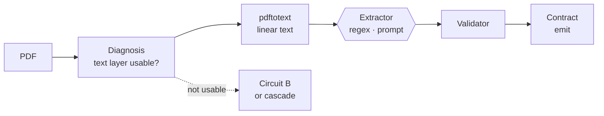
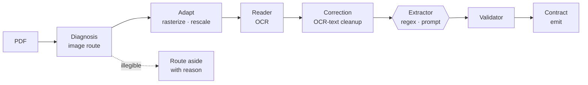
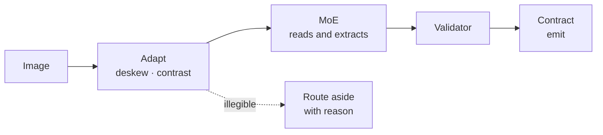

# Workflows

How the direct circuits are built out of the components defined in `components.md`.

`components.md` defines the **components** (named by what they produce) and `README.md` the **three general flows** (Rules, Interpretation, Vision — named by what the extractor receives). This document defines the **direct circuits** (named by what the input is) and maps each one onto those components.

Three things vary independently, and conflating them is the main source of confusion here:

| Axis | Named by | Answers | Fixed by |
|---|---|---|---|
| **General flows** (`README.md`) | Extraction method | *How do we read the values?* | The extractor chosen |
| **Circuits** (this file) | Input type | *How do we obtain something readable?* | The input document |
| **Extractor** (per circuit) | Method | *Regex or prompt?* | A routing decision inside the circuit |

A circuit fixes how readable material is obtained. It does **not** fix how values are read from it — that is a separate choice, and in the text circuits both regex and prompt are available. See **The extraction axis** below.

---

## Why circuits exist

The general cascade runs every component. That is correct for a mixed, unknown corpus and expensive for a homogeneous one.

At 11k files most inputs will fall into three narrow shapes: a PDF that already has clean text, a PDF that is pure image, and a plain image. For those, most components have nothing to do — the Segmenter on a single-invoice image, the Identifier once the type is known, the Reconstructor on one page.

A circuit is the same pipeline with the components whose job is already known to be unnecessary removed.

---

## The selector: Diagnosis

Circuits are not a separate architecture — they are the routes **Diagnosis** already computes.

`components.md` has Diagnosis running before the read, detecting what is there, measuring whether it is processable, and adapting the input. Its own routing table is what separates a text layer from an image. A circuit is Diagnosis's verdict carried to its conclusion instead of merging back into the shared path.

That is also why the circuits keep a piece of Diagnosis even when they skip nearly everything else: without the detection step there is no gate, and the circuit's input assumption is unchecked.

**The gate must be quality, not presence.** `components.md` is explicit that a PDF can carry an old, bad OCR layer, and that routing by presence sends it to conversion and drags its errors along unreviewed. The check is proportion and quality — a layer with 40 characters on an A4 sheet is not a text PDF.

---

## The extraction axis

Obtaining readable material and reading values out of it are **two separate decisions**. Conflating them is the main source of confusion in these circuits.

| Axis | Question | Options |
|---|---|---|
| **Circuit** | How do we obtain something readable? | linear text, OCR text, pixels |
| **Extractor** | How do we read values from it? | regex (Rules), prompt (Interpretation), fused into the model (Vision) |

They are orthogonal. `pdftotext` yields a text stream — that fact says nothing about how the values get read from it, and neither does the text OCR produces. The available combinations:

| Circuit | Material | regex | prompt | fused |
|---|---|:---:|:---:|:---:|
| **A — Text PDF** | linear text | ✓ | ✓ | — |
| **B — Image-only PDF** | OCR text | ✓ | ✓ | — |
| **C — Image** | pixels | — | — | ✓ |

**A and B are text circuits, so both extractors apply.** Regex first with a prompt fallback, prompt first with regex as a check, or a split by field or document type — all legitimate. Which one to use is a **routing decision inside the circuit**, not a property of the circuit.

**C has no extractor choice.** With no text intermediate, the model reads the pixels and emits fields in one pass, so regex never has a string to run on. That is the same reason `README.md` says Vision uses neither Diagnosis nor Reader.

### This recovers contrast cheaply

`components.md` reserves cross-flow contrast because running two full flows is expensive — each one re-acquires the document. In a text circuit the acquisition is **already paid for**: the text is in hand, so running both a regex and a prompt over it costs one extra model call on critical fields, not a second pass over the document.

| Circuit | Contrast available |
|---|---|
| **A, B** | **Yes** — regex vs prompt over the same text, cheap on critical fields |
| **C** | No — one fused read, nothing to contrast against |

This is the strongest argument for keeping a regex path even when a prompt is the primary extractor: it is not a fallback, it is the second opinion that catches a plausible-but-false value.

---

## Component usage

Which components each route runs, relative to the general cascade.

| Component | Cascade | A: Text PDF | B: Image-only PDF | C: Image |
|---|:---:|:---:|:---:|:---:|
| **Segmenter** | ✓ | — | — | — |
| **Identifier** | ✓ | — | — | — |
| **Diagnosis** | ✓ | ✓ | ✓ | ◐ |
| **Reader** | ✓ | ◐ | ✓ | — |
| **Reconstructor** | ✓ | — | — | — |
| **Validator** | ✓ | ✓ | ✓ | ✓ |
| **Consistency** | ✓ | — | — | — |
| **Catalog** | ✓ | — | — | — |
| **Contract** | ✓ | ✓ | ✓ | ✓ |
| **Reviewer** | ✓ | ✓ | ✓ | ✓ |

✓ runs in full · ◐ runs partially or in a reduced form · — does not run

**The extraction step varies along two axes, the surrounding contract does not.** The Reader row is ◐ in A and B because both route to conversion or OCR rather than the component's full per-page routing. Then, per the extraction axis above, A and B each choose regex or prompt, while C fuses reading and extraction into a single model call. All three then run the same Validator and Contract.

**Two components run in every route.**

- **Validator** — it does not care how a value was obtained. Schema, type, content and check-digit checks apply unchanged whatever produced the field. Dropping validation is what would make a circuit a fork of the system rather than a route through it.
- **Contract** — this is what makes circuits substitutable at all. The consuming system must receive the same output shape whether a file went through the cascade or a circuit, so the Contract and its verdict vector are non-negotiable.

---

## Circuit A — Text PDF

**Input:** a PDF with a usable text layer, containing one logical document.

| Step | Component it stands in for | What it does |
|---|---|---|
| Text layer check | Diagnosis | Proportion and quality of the layer |
| `pdftotext` | Reader (conversion) + Reconstructor | Emits a linear text stream |
| Extractor | Rules **or** Interpretation | Regex or a prompt over the linear text |
| Schema, type, arithmetic | Validator | Unchanged |
| Verdict vector | Contract | Unchanged |

**Where the reduction is honest.** Conversion has no correction step — `components.md` is clear that a converter does not read badly, it transcribes what is there, and that applying a language model "just in case" can only introduce damage. A text PDF genuinely does not need OCR or correction.

**Where the reduction is a trade.** `pdftotext` produces reading order, but it does so heuristically: it does not associate a table header with rows continuing on the next page, and it does not collapse a header repeated across five pages. That is the Reconstructor's job and it is not being done. Linear text with a broken table is still plausible-looking text, so the failure is quiet.

### Choosing the extractor

Both extractors run over the same linear text, so the choice is open and costs nothing to revisit:

| | Regex (Rules) | Prompt (Interpretation) |
|---|---|---|
| Invented values | **No** — captures what is there or fails | **Yes** — can produce a value nobody wrote |
| Bad anchor | Textual proximity: a real value from the neighboring block | Semantic confusion: a real value attributed to the wrong field |
| Deterministic | Yes | No |
| Handles wording variation | Needs a pattern per variant | Tolerates it |
| Cost | Negligible | One model call |
| Trace | Exact offset | Quote + offset |

Neither dominates, and the sensible use is **both**:

- **Regex where the field is stable** — identifiers, dates, amounts with a known format. Deterministic, free, and it invents nothing.
- **Prompt where the wording varies** — supplier names, descriptions, fields whose anchor differs per issuer. At 11k files the variants are unknown, and a pattern per variant is what makes pure-regex brittle.
- **Both on critical fields** — the contrast described in the extraction axis above. This is the cheapest place in the whole system to get a second opinion, because the text is already in hand.

The trace depends on which ran: a regex match yields an **exact offset**, a prompt yields a **quote plus offset**. Both are offsets into a text stream, which keeps traceability stronger here than in the vision route regardless.

---

## Circuit B — Image-only PDF

**Input:** a PDF with no usable text layer, containing one logical document.

This is the general cascade **minus segmentation, identification, reconstruction and contrast** — the sequence `components.md` already describes for the image path, terminated after extraction.

| Step | Component it stands in for | What it does |
|---|---|---|
| Image route | Diagnosis | Detects no usable layer, measures legibility |
| Rasterize, rescale, compress | Diagnosis (adapt) | Prepares the input for OCR |
| OCR | Reader (OCR path) | Extracts tokens, with estimated confidence |
| OCR correction | Reader (correction) | The only path where correction is legitimate |
| Extractor | Rules **or** Interpretation | Regex or a prompt over the corrected text |
| Validation | Validator | Unchanged |
| Emit | Contract | Unchanged |

**Legibility is the gate, and it is not resolution.** `components.md` distinguishes the two: an image can have enough DPI and still be out of focus. Passing a blurred page to OCR anyway is the one invalid outcome it names — OCR returns invented text indistinguishable from a real reading. This circuit therefore inherits both valid exits from Diagnosis (preprocess, or route aside with a reason) and must not add a third.

**What the correction step needs.** It is the highest-risk step in the circuit: it is a model editing text, so it can silently change a value. Correction must be scoped to characters and spacing, never to digits, and the raw OCR output has to be retained alongside the corrected text for audit. `d.md`'s rule applies directly — auditing is not normalizing, and the raw value is what diagnostics are built from.

**The extractor choice is the same as in circuit A**, with one addition: OCR error is present in the text, so a pattern has to tolerate the misreads OCR actually produces. That cuts both ways — a regex can be written to accept `O` for `0` in a known position, while a prompt handles unfamiliar corruption better but may quietly repair a digit it should have flagged.

**Where the reduction is a trade.** No Reconstructor means no table reconstruction, so the extractor sees text whose row structure may already be broken. `components.md` warns that structure has to be validated separately, because a shifted column has real amounts and passes every value check.

---

## Circuit C — Image

**Input:** a photo or scan, single page.

| Step | Component it stands in for | What it does |
|---|---|---|
| Image treatment | Diagnosis (adapt only) | Deskew, contrast, rescale |
| MoE | Interpretation + Vision fusion | Reads and extracts in a single pass |
| Validation | Validator | Unchanged |
| Emit | Contract | Unchanged |

**This is the shortest route and the only one with no separate read step.** `components.md` notes that Vision uses neither Diagnosis nor Reader: it hands pixels to the model, which reads and extracts in one step. This circuit is that observation taken literally, with only the treatment half of Diagnosis retained because a photo needs geometric correction before any model sees it.

**Diagnosis is partial here, and that is the risk.** With the detection half gone, nothing measures whether the image is legible before the MoE is asked to read it — so the model is the first thing to see the pixels, and a low-quality input surfaces as low-confidence extraction rather than as a routing decision. The treatment step is the only defense, and it corrects, it does not reject.

**No continuity step.** The general Vision flow still needs cross-page continuity (`components.md` marks it ◐ there for exactly that reason). A single-page image has no page boundary, so the circuit does not drop this step — the step has nothing to do.

---

## What every circuit gives up

Grouped by the component removed, since `components.md` already states each consequence.

| Removed | Consequence | Detectable downstream? |
|---|---|---|
| **Segmenter** | Assumes one file = one document. Fields from a second document overwrite the first's | **No** — `components.md` calls this unrecoverable and silent |
| **Identifier** | No type, so no template routing and no evidence record. A misrouted document is invisible | Only as a badly extracted field, at the end |
| **Reconstructor** | No cross-page table continuity, no header collapsing, no reading order | Partially: as missing or misattributed fields |
| **Catalog** | Identity fields never checked externally. A valid CUIT on the wrong company is undetected | Only by a human eventually noticing |

**Contrast is not on that list, and that is the correction.** An earlier reading of these circuits treated cross-flow contrast as given up — true only if each circuit commits to a single extractor. Since a text circuit can run **regex and prompt over the same text** (see the extraction axis), A and B keep contrast on critical fields for one extra call. Only **C** genuinely gives it up, because its single fused read leaves nothing to compare against.

So the silent losses are narrower than they first appear:

| Circuit | Silent losses |
|---|---|
| **A, B** | The **Segmenter** only |
| **C** | The **Segmenter** and **contrast** |

**The Segmenter is the one gap no circuit closes.** Every other reduction degrades into something visible — a missing field, a low confidence, an arithmetic failure. A merge error produces output that looks correct, which is why the gate matters more than the speed.

---

## Escalation

A circuit that cannot finish must **escalate into the general cascade**, not to review.

`components.md` makes the Validator the single place where "could not" is defined, and this is why: a circuit failure is not a new kind of failure, it is the existing escalation with a lower starting point.

**The two escalation kinds cost differently**, and a circuit is more likely to produce the second:

| Kind | What is there | Cost |
|---|---|---|
| **Invalid field** | Value, page, offset | Renders the region. Cheap and precise |
| **Missing field** | Nothing to point at | Whole document re-read — no saving over the cascade |

A circuit routinely has *less* to point at than the cascade, because without the Reconstructor it has no resolved structure to locate a field in. So where the cascade escalates cheaply, a circuit can escalate expensively. This is the number that decides whether a circuit pays: **cost saved on the files it handles, against cost of files it hands on having done partial work.**

**Escalation also recovers the contrast.** A circuit's value exists, so when the cascade re-reads the field, the two values can be compared exactly as two flows are — the circuit is a cheap second opinion that was already paid for.

---

## Output equivalence

Every route emits through the **Contract**, so outputs are shape-identical and the consumer needs no per-circuit logic.

The verdict vector is what makes this honest rather than merely convenient. A field from a circuit will typically carry *weaker* verdicts than one from the cascade — no `consistency` reinforcement, `catalog: unverified` — and the Contract reports that instead of hiding it. The consumer threshold does the rest.

| Verdict | Cascade | Circuit A | Circuit B | Circuit C |
|---|---|---|---|---|
| `shape` / `type` / `content` / `digit` | From Validator | Same | Same | Same |
| `consistency` | Reinforcement or disagreement | `null`, unless both extractors ran | `null`, unless both extractors ran | `null` |
| `catalog` | Verified / unverified | `unverified` | `unverified` | `unverified` |

Note the A and B qualifier: when the circuit runs **both** extractors over its text — regex and prompt on a critical field — it produces a genuine cross-extractor contrast, and `consistency` reflects it. That is the one case where a direct circuit reaches the confidence of the cascade without paying for a second acquisition of the document.

**This is the argument for the verdict vector over a score.** With a single confidence number, a circuit's output and the cascade's would have to be collapsed to the same scale and the difference would vanish — a field nobody cross-checked would look the same as one that survived contrast. Kept separate, the consumer can require `consistency` for critical fields and accept `null` for the rest.

---

## Open questions

- **Declared or inferred.** Whether the caller names the circuit (`--circuit text-pdf`) or the system selects it from Diagnosis. Declared is cheaper and puts the error on the caller; inferred means paying for the detection step before the saving starts.
- **Whether the circuits need the Segmenter after all.** It is the one component whose absence is silent. A cheap continuity check — page numbering, header recurrence — may be enough to keep it, and would close the only silent gap without restoring the full component.
- **Where the fast-path/general-flow boundary is.** This document maps circuits to components but does not fix a selection policy, so nothing yet decides which files take the cheap route.
- **Whether the MoE in circuit C is the general cascade's Vision model** or a cheaper specialist. It decides whether tuning and the golden set carry over between them.
- **Whether the OCR correction step is validated against this circuit's own output.** Since it edits text, it should be measured on the golden set like any other extraction step.
- **`pdftotext` is a poppler dependency** (external binary). It needs a stated version and a fallback, or circuit A silently depends on whatever the host has.
- **What decides regex vs prompt, and per what.** Per field, per document type, or first regex then prompt on failure. The choice is cheap to change per file but has to be expressed somewhere, and this document does not say where.
- **What the extraction prompt is built from.** Whether it is per document type, derived from the schema, or shared with the general Interpretation flow. If shared, the tuning carries over; if not, there are two prompt sets to maintain.
- **Whether running both extractors is the default or reserved for critical fields.** Both over the whole document doubles cost on a route chosen to be cheap, so the likely answer is critical fields only — but that needs a definition of "critical", which today only exists as the contrast policy in `components.md`.
- **Whether a text PDF with a bad text layer falls through to circuit B.** The gate rejects it, but the next step is stated as "B or cascade" and nothing decides which.
